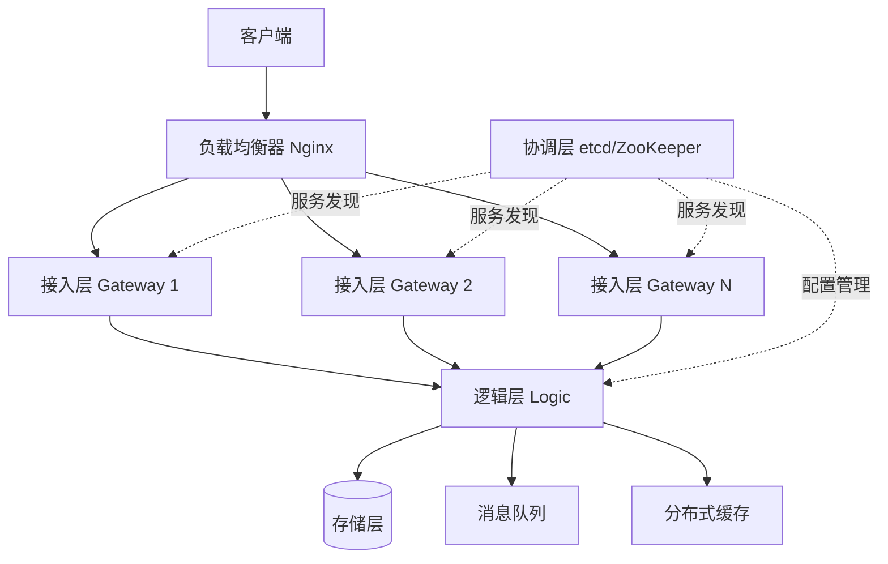

# node




```shell
cd server && go run .
```

###deamon
```shell
(cd ./server/cmd && go run . kafka_consumer -c ./../config.toml)
```

```shell
(cd ./server/cmd && go run . log_cli -c ./../config.toml)
```